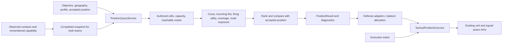

# Influence position advice

Influence maps now provide completed team knowledge and terrain snapshots to one position-query pipeline. Defense, support-by-fire, advance and assault share candidate eligibility, features, route checks, destination capacity and acceptance logic. Querying never issues an order. Existing defense analyzer/planner/controller entry points remain adapters.



## Ownership, geography and knowledge

Explicitly empty assignments remain empty. Adapters filter and deduplicate the requested team's units; the platoon accepts results only for owned squads. At match startup, inspector squad references identify company/platoon/squad slots which are rebound to the active scenario. Missing slots remain unassigned. Inactive map units cannot receive movement orders.

Only the enemy team's platoon executes automatic missions. The selected player's planner is disabled and rejects mission updates and tactical ticks. Disabling a planner clears its mission, assignments and reservations, stops its owned pending movement, and releases arrival callbacks without replacing newer manual commands. Objective contexts and position queries remain available for both teams.

`PositionQuery.Geography` selects an objective radius, an explicit sector, or their union. Fallback cells are evaluated only if the primary geography has no feasible candidate, and pass the same terrain, route, capacity and risk checks. `(0,0)` is a valid coordinate. The defense director explicitly chooses an authored objective, the owned platoon's starting anchor, or the scenario's target. The two world directors use platoon anchors; switching maps therefore changes their defensive geography with the scenario.

The default `OBSERVED_AND_MEMORY` policy combines current friendly observations and unexpired enemy firing memory. Firing memory stores location, capability and effectiveness at observation time, with confidence decaying over the existing six-second lifetime. Defense additionally retains last-confirmed danger locations after those firing tracks expire. A new observation updates the location; physically checking the old hex, observing a casualty, or resetting the match clears it. Location confidence declines to a floor of 0.5, but uncertainty does not reduce the captured firing capability used for defensive safety checks. This prevents repeated returns to the same dangerous lane after losing LOS. Hidden live positions/loadouts and unobserved casualties are not consulted. `OMNISCIENT` is an explicit alternative for debugging/scenarios and does not populate observed defensive memory.

Actual known enemy fire writes `THREAT`; possible future approach positions write `FORECAST_THREAT`. One enemy's capability is divided across its alternative forecast locations. Both teams' fresh maps and routes publish together after budgeted LOS/composite work finishes. Readers keep the prior complete generation during rebuilding. Match startup discards pending captures from the previous setup. Published arrays are read-only by contract and are never reused as rebuild buffers.

Team objective contexts are captured with the snapshot. Queries for another objective compute and cache their own forecast from that same captured knowledge, including during an objective change and for simultaneous platoon objectives. They do not mutate the published layers or resample enemies.

## Query and acceptance contract

`PositionQuery` carries the unit, team, objective, profile, geography, reservations and optional accepted target/context/time. `InfluenceMapController.query_positions()` attaches the latest complete snapshot. The service excludes unauthored/no-go cells, disabled or disconnected destinations, occupied cells, reserved destinations and excessive danger. Defense requires terrain cover at its destination and keeps both destinations and route steps at least two hexes from confirmed enemy locations. A query-local defensive route graph excludes unsafe steps and weights covered travel; other profiles retain their existing route graph. The origin is exempt from route exposure/proximity limits so a squad can escape an unsafe starting hex. Queries use exact graph cells rather than silently substituting a nearest point. Surrendered/empty units and units routing or combat ineffective cannot receive advice; assault also requires sufficient effectiveness, ammunition, suitable morale and a combat role.

`PositionResult` returns status/reason, the proposed and accepted cells, score, previous score, path, feature breakdown, alternatives, eligibility mask, rejection counts, snapshot version and mission context. Feasible zero or negative utility is allowed. Exclusion is independent of score. The older score-map-only helper cannot express eligibility and continues to require positive candidates; an all-zero diagnostic map returns no candidate.

The baseline is the unit's actual position unless a feasible accepted destination belongs to the same context. Defense holds a safe accepted destination for at least eight seconds and while moving there. After that commitment, a change requires improvement above `max(0.35, abs(previous_score) * 0.20)`; other profiles retain `max(0.15, abs(previous_score) * 0.10)`. A changed objective/geography/profile invalidates the commitment, while an appearing or disappearing defensive threat axis does not. Unsafe destinations or routes invalidate retention immediately. A declined proposal reserves the retained destination. Capacity is hard rather than a soft score penalty. Reservations are passed explicitly by the allocator; multiple allocators sharing destination capacity should share that reservation pool.

Defense evaluates the remaining accepted route first and keeps it if still safe, even when another route has become shorter. An accepted move continues without restarting when its remaining route equals the evaluated route. A changed unsafe route must be replaced. Execution rechecks the live graph before ordering. If advice becomes infeasible, the planner cancels its own pending movement and arrival intent; it does not substitute a move to the unchecked objective or cancel a replacement action owned elsewhere. Holding with an explicit no-candidate result is valid when terrain offers no safe covered route.

## Profiles and initial calibration

Incoming fire and firing utility use `max(x,0)/(1+max(x,0))`. Firing utility evaluates the querying unit's living, armed soldiers, ammunition, range, accuracy, burst/reload cycle and effectiveness against visible approach lanes. It is a deterministic advisory estimate and does not consume ammunition or run combat randomness. HQ firing utility has zero weight, MG firing weight is multiplied by 1.7, and mortar firing weight by 1.3. Incoming-risk weight doubles for HQs and increases by 1.5 for mortars.

| Feature / limit | Defense | Support-by-fire | Advance | Assault |
| --- | ---: | ---: | ---: | ---: |
| Cover | 3 | 2 | 2 | 0.8 |
| Incoming risk penalty | 3 | 3 | 3 | 3 |
| Forecast risk penalty | 1 | 1 | 1 | 1 |
| Firing utility | 1.2 | 3 | 0.5 | 1.2 |
| Objective coverage | 2 | 0 | 0 | 0 |
| Friendly support | 0.3 | 0.3 | 0.3 | 0.3 |
| Travel penalty | 0.12 | 0.08 | 0.08 | 0.03 |
| Mean route exposure penalty | 3 | 2 | 2 | 2 |
| Mean open-ground transit penalty | 1 | 0 | 0 | 0 |
| Progress | 0 | 0 | 4 | 6 |
| Maximum destination / peak route risk | 0.65 | 0.8 | 0.8 | 0.9 |
| Minimum destination cover | 0.1 | 0 | 0 | 0 |
| Minimum enemy distance in hexes | 2 | 0 | 0 | 0 |
| Maximum open-ground transit risk | 0.15 | 1 | 1 | 1 |

Cover is normalized to 0–1. Defense computes transit danger without stationary target cover and includes the objective forecast; mean exposure affects ranking while peak exposure and open-ground risk exclude unsafe routes. Better endpoint cover cannot compensate for a forbidden transit step.

Support-by-fire requires LOS and usable firing capability toward the mission target. Advance searches within the movement radius without increasing objective distance. Assault searches within that radius at the objective or an adjacent unoccupied cell. An occupied enemy objective remains excluded as a destination; assault advice can therefore provide an adjacent assault position rather than authorizing occupied-cell movement.

The existing diagnostic composite retains its original weights. `LEGACY_DEFENSE` preserves the objective-stamp scoring math on the corrected candidate set. A regression compares scores across eligible candidates before testing the calibrated profile; authored-map reports compare legacy and defense recommendations over the same completed snapshot. Eligibility and knowledge repairs intentionally change the prior buggy behavior.

## Execution and diagnostics

`MissionOrder.position_mode` chooses advice. `MissionOrder.execution_intent` separately chooses hold, support-by-fire, advance or assault; `FROM_PROFILE` supplies the corresponding default. The defense director exposes both settings. Merely requesting an offensive profile does not execute it.

Hold/advance use existing move-and-hold orders. Support-by-fire moves to a firing position, then sends the existing ground-fire command after arrival and a current LOS/range check. Its owned fire target is released when canceled or replaced; sustained support can resume after the existing ground-fire round budget finishes. Assault uses the existing attack order with the final route cell as the exposed segment. Existing position-establishment timers remain intact. Arrival callbacks carry the squad action's order ID, so replaced commands cannot trigger old intents. Retained advice does not repeatedly issue completed hold/fire commands.

The debug overlay retains team layers and distinct captured axis composites. Clicking a unit automatically opens its team's position scores. Green outlines mark feasible candidates (including zero or negative utility); gold marks the recommended destination. Ineligible cells are excluded by the query's eligibility mask. Player inspection queries the completed snapshot without enabling AI or issuing orders; AI inspection shows the exact assigned result and its reservation diagnostics. The overlay refreshes with snapshots and displays a reason when no candidate is feasible. Deselecting restores the previous team layer.

`8` displays actual threat, `F2` displays forecast threat, and `F1` returns to the selected unit's position scores. Layer shortcuts remain usable during selection. Full tactical advice is available on `Unit.position_advice` and platoon assignments; read-only inspection advice stays on the overlay.

## Validation

Run from the project root, using separate XDG directories to isolate user saves:

```bash
python3 tests/check_gdscript_conventions.py
env XDG_DATA_HOME=/tmp/acl-influence-data XDG_CONFIG_HOME=/tmp/acl-influence-config XDG_CACHE_HOME=/tmp/acl-influence-cache godot --headless --path . tests/gdscript_parse_check.tscn
env XDG_DATA_HOME=/tmp/acl-influence-data XDG_CONFIG_HOME=/tmp/acl-influence-config XDG_CACHE_HOME=/tmp/acl-influence-cache godot --headless --path . tests/influence_positions_regression.tscn
env XDG_DATA_HOME=/tmp/acl-influence-data XDG_CONFIG_HOME=/tmp/acl-influence-config XDG_CACHE_HOME=/tmp/acl-influence-cache godot --headless --path . --fixed-fps 60 tests/influence_match_regression.tscn -- --report=/tmp/acl-default-map.json
env XDG_DATA_HOME=/tmp/acl-influence-data XDG_CONFIG_HOME=/tmp/acl-influence-config XDG_CACHE_HOME=/tmp/acl-influence-cache godot --headless --path . --fixed-fps 60 tests/influence_match_regression.tscn -- --axis --report=/tmp/acl-default-map-axis-player.json
env XDG_DATA_HOME=/tmp/acl-influence-data XDG_CONFIG_HOME=/tmp/acl-influence-config XDG_CACHE_HOME=/tmp/acl-influence-cache godot --headless --path . --fixed-fps 60 tests/influence_match_regression.tscn -- --default-map --report=/tmp/acl-orchard-road.json
env XDG_DATA_HOME=/tmp/acl-influence-data XDG_CONFIG_HOME=/tmp/acl-influence-config XDG_CACHE_HOME=/tmp/acl-influence-cache godot --headless --path . --fixed-fps 60 tests/defensive_posture_match_regression.tscn
env XDG_DATA_HOME=/tmp/acl-influence-data XDG_CONFIG_HOME=/tmp/acl-influence-config XDG_CACHE_HOME=/tmp/acl-influence-cache godot --headless --path . --fixed-fps 60 tests/defensive_posture_match_regression.tscn -- --axis
env XDG_DATA_HOME=/tmp/acl-influence-data XDG_CONFIG_HOME=/tmp/acl-influence-config XDG_CACHE_HOME=/tmp/acl-influence-cache godot --headless --path . --fixed-fps 60 tests/defensive_posture_match_regression.tscn -- --default-map
```

The focused suite covers eligibility, ownership, execution, player handoff, mandatory defensive cover, safe detours, destination/route commitment, proximity limits and durable observed danger. Authored-map checks cover both player-team selections on DefaultMap and the Allies selection on OrchardRoad. Parser and convention checks cover all 183 included project scripts. The initial comparison data, captured before automatic execution was restricted to the enemy team, is recorded in [influence_position_calibration.json](../tests/fixtures/influence_position_calibration.json).

The match checks use seed 6049, run 600 simulation frames, sample assignments every second, and then compare profiles on one frozen snapshot. Player hold commands survive automatic reconsideration while enemy allocation remains active. Both teams can query positions covering their defensive objective, owned destinations remain distinct, and repeated advice stays stable. Explicit omniscient captures then verify risk-limited advice on the same terrain. Real action-controller checks exercise offensive dispatch and support-fire start/cancellation. These are initial calibration checks on DefaultMap and OrchardRoad, not a full-match balance or large-force performance benchmark.

The defensive-posture match checks use real movement and perception while pausing combat/stress to isolate positional behavior. After settling, a player rifle squad relocates to a reachable hex two hexes from a defender, holds still for forty seconds, and supplies one confirmed sighting. The checks verify covered destinations, transit exposure, proximity, lasting contact knowledge and order stability after ten seconds of settling. On constrained terrain, no safe candidate must leave the defender holding with no pending movement.

The defensive-posture revision passes 110 focused checks, all 183 parser/convention checks, the three existing authored-match configurations (160, 160 and 122 checks), all three relocation/stability configurations (289, 289 and 87 checks), and 600-frame smoke runs on both maps. Both OutpostProbe teams show zero target changes after settling against the relocated stationary player; constrained OrchardRoad terrain correctly reports no safe candidate and holds.

Earlier pipeline validation passed all 23 existing regression configurations, along with fresh-process weapon and casualty persistence checks. That broader batch covered combat, movement/arrival, rosters, death/casualties, saves, loadouts, match decomposition and objective visibility in four configurations. Existing scenario tests log the missing optional `user://matches/debug.tres` and shutdown resource warnings. Editor import also reports pre-existing hexagon-addon null-callable errors while reopening scenes. The loadout baseline intentionally exercises the pre-existing German company-HQ `nicknam` typo. Those diagnostics remain outside this change.
