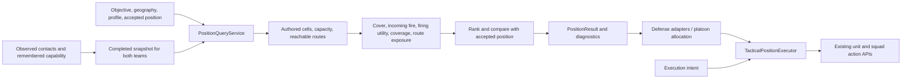

# Influence position advice

Influence maps now provide completed team knowledge and terrain snapshots to one position-query pipeline. Defense, support-by-fire, advance and assault share candidate eligibility, features, route checks, destination capacity and acceptance logic. Querying never issues an order. Existing defense analyzer/planner/controller entry points remain adapters.



## Ownership, geography and knowledge

Explicitly empty assignments remain empty. Adapters filter and deduplicate the requested team's units; the platoon accepts results only for owned squads. At match startup, inspector squad references identify company/platoon/squad slots which are rebound to the active scenario. Missing slots remain unassigned. Inactive map units cannot receive movement orders.

Only the enemy team's platoon executes automatic missions. The selected player's planner is disabled and rejects mission updates and tactical ticks. Disabling a planner clears its mission, assignments and reservations, stops its owned pending movement, and releases arrival callbacks without replacing newer manual commands. Objective contexts and position queries remain available for both teams.

`PositionQuery.Geography` selects an objective radius, an explicit sector, or their union. Fallback cells are evaluated only if the primary geography has no feasible candidate, and pass the same terrain, route, capacity and risk checks. `(0,0)` is a valid coordinate. The defense director explicitly chooses an authored objective, the owned platoon's starting anchor, the scenario's target, or an opponent capture target. The two world directors protect the opponent's capture marker A, with an explicit starting-anchor fallback when that side has no corresponding marker. OrchardRoad therefore protects the actual objective `(8,4)`, rather than the Axis spawn `(12,3)`.

The default `OBSERVED_AND_MEMORY` policy combines current friendly observations and unexpired enemy firing memory. Firing memory stores location, capability and effectiveness at observation time, with confidence decaying over the existing six-second lifetime. Defense additionally retains last-confirmed danger locations after those firing tracks expire. A new observation updates the location; physically checking the old hex, observing a casualty, or resetting the match clears it. Location confidence declines to a floor of 0.5, but uncertainty does not reduce the captured firing capability used for defensive safety checks. This prevents repeated returns to the same dangerous lane after losing LOS. Hidden live positions/loadouts and unobserved casualties are not consulted. `OMNISCIENT` is an explicit alternative for debugging/scenarios and does not populate observed defensive memory.

Actual known enemy fire writes `THREAT`; possible future approach positions write `FORECAST_THREAT`. One enemy's capability is divided across its alternative forecast locations. Both teams' fresh maps and routes publish together after budgeted LOS/composite work finishes. Readers keep the prior complete generation during rebuilding. Match startup discards pending captures from the previous setup. Published arrays are read-only by contract and are never reused as rebuild buffers.

Team objective contexts are captured with the snapshot. Queries for another objective compute and cache their own forecast from that same captured knowledge, including during an objective change and for simultaneous platoon objectives. They do not mutate the published layers or resample enemies.

## Query and acceptance contract

`PositionQuery` carries the unit, team, objective, profile, geography, reservations, defensive responsibility, withdrawal request and optional accepted target/context/time. `InfluenceMapController.query_positions()` attaches the latest complete snapshot. The service excludes unauthored/no-go cells, disabled or disconnected destinations, occupied cells, reserved destinations and excessive danger. Defense requires terrain cover and an objective responsibility. There is no minimum enemy separation: adjacent covered positions remain eligible, and proximity is a contextual score penalty only when the captured enemy can see the position. Queries use exact graph cells rather than silently substituting a nearest point. Surrendered/empty units and units routing or combat ineffective cannot receive advice; assault also requires sufficient effectiveness, ammunition, suitable morale and a combat role.

`DefensePositionPolicy` evaluates three responsibilities before scoring cover quality:

- `OCCUPY` requires the objective hex itself.
- `GUARD` requires usable fire or physical occupation of the objective. With a known approach it stays within one hex; without contacts it can use covered ground within the defense radius.
- `COVER_APPROACH` requires usable fire or physical blocking over at least half of the weighted objective-side interception area of a predicted approach. This area contains corridor cells within the query's defense radius (at least one hex). The remainder of a long corridor contributes firing utility and diagnostics, without disqualifying a defender that protects the final approach. `AUTO` accepts any of the three responsibilities.

`DefenseAreaJob` assesses the objective area before allocation. It identifies covered cells and boundaries with open ground using the building layer's existing cover data, including woods. A terrain travel field runs backward from the objective. For each of six stable geographic sectors, a captured contact or an inferred entry supplies a forward field. Currently observed contacts take precedence over remembered contacts as corridor sources; within the same evidence class, captured strength, freshness and arrival urgency select the source. A stale nearby contact cannot anchor the corridor for a fresh attack elsewhere in that sector. Cells on routes within 2.5 terrain travel-cost units of the optimum form an approach corridor, including alternative routes. Both forward and reverse distance must stay within the complete source-to-objective cost, excluding branches reached after arriving at the objective. Corridor cell weights combine route plausibility with vulnerability and exposed crossing time. This is an advisory route model, not a casualty estimate or an assumption that attackers must follow one path.

Captured strength, confidence, observation age and estimated objective arrival time determine sector priorities. Directional pressure decays over 12 seconds; persistent danger knowledge remains available to transit safety even when that approach loses priority. Terrain entry priors provide modest coverage duties before sightings. While known contacts or explicit mission axes remain, each inferred priority is capped at 20% of the strongest known approach after arrival weighting. Aging a confirmed sighting cannot promote an arbitrary boundary estimate above it. Queries do not read hidden live enemy locations or speed. Observation records capture speed and time alongside capability.

Geometry, the objective field, minimum open-ground return field and reverse response fields from covered sector boundaries are cached across intelligence snapshots, keyed by terrain/topology, team, objective and area extent. The return field runs backward from the objective and its adjacent covered guard positions: covered steps cost zero, open steps cost their terrain travel multiplier. Zero return cost identifies terrain-connected cover at the objective; a detached woodlot across fields incurs the minimum open crossing time needed to regain objective access. This is a static lower bound, independent of friendly occupancy and known fire; it is not a safe return-route guarantee. Dynamic corridors are shared within a snapshot. Area work and position searches share the controller's 2,000-microsecond budget. Readers and platoons retain completed advice until the replacement batch finishes. Snapshot references held by area jobs are weak to avoid a snapshot/job ownership cycle.

Automatic defense allocation selects its objective guard before selecting a reserve. Healthy squads carrying tripod MGs take precedence over bipod MGs, which take precedence over rifle-only infantry. `WeaponSpec.mount` explicitly identifies MG34/M1919 tripod weapons and MG34/BAR bipod weapons. The strongest MG mount carried by a living runtime soldier determines stationarity, including mixed rifle/MG squads; squad labels and display names do not substitute for that equipment. Runtime casualties and weapon transfers override the original recipe. Authored loadouts supply the fallback only when no runtime roster exists. Temporary jams, reloads and ammunition availability do not rotate guard ownership. Ineffective squads, headquarters and mortars retain lower guard priority.

With one rifle squad and one tripod team, the MG guards the objective and the rifle covers the approach. Additional MG teams may cover forward sectors after that anchor is retained. Among equally effective remaining squads, reserve selection prefers the less stationary loadout. The reserve scores its mean and worst response to important sector boundaries and deploys when keeping it idle would leave a significant sector without an assigned squad. `KEEP_HQ_NEAR_OBJECTIVE` remains an explicit exception.

Remaining squads receive explicit sector responsibilities using priority, weapon role, terrain response time and diminishing benefit from extra squads on the same sector. Existing-sector priority preferences are 25% for rifle-only squads, 40% for bipod squads and 55% for tripod squads; substantially greater pressure can override them. Stationary equipment also raises the travel cost of assigning a different sector and strengthens preference for retaining an established assignment. Equipment is inspected once per squad during sector allocation rather than per candidate hex.

`MissionOrder.defense_area_radius` defaults to 8 and `approach_analysis_radius` to 12. For objective-or-sector missions, covered positions in the assessed area join the original objective radius. Explicit objective-radius and sector-only geography remain authoritative. One squad retains `AUTO` responsibility so capture protection is still available when it cannot cover half of a long corridor. `PositionQuery.use_defense_area = false` retains the earlier explicit shortest-path approach contract for low-level compatibility and comparison tests. The captured defensive mount forms part of the query context: losing a support weapon invalidates its old commitment and inspection cache. Planning and manual inspection both apply the same per-unit profile factory; reusing a calibrated profile does not compound its penalties.

Relocation preserves important known or explicitly tasked approaches, using weighted local interception coverage. Inferred terrain approaches guide scoring and the assigned squad's local duty, but cannot impose unrelated mandatory screen preservation in every unseen direction. An old known approach below 40% of the dominant priority can release its screen; a newly assigned approach more than 1.4 times as important can supersede the old duty. Otherwise the destination must retain coverage or use an established friendly covering squad. A moving, routing, ineffective, broken, establishing or regrouping squad cannot provide the handoff; neither can a reservation for a different future position. These checks prevent simultaneous planned departures from counting as covering support. Automatic area planning also allows only one new relocation at a time, waiting through movement and establishment before releasing another squad. An unchanged accepted move can continue. Uncovered important sectors are reported in `PlatoonAI.defense_gaps`; capacity or safety failures return explicit no-candidate advice.

`PositionRouteField` builds a weighted Dijkstra flood with nondominated labels for travel cost, accumulated exposure and accumulated open-ground exposure. This retains slower feasible alternatives when a faster route exhausts the mission budget. Each edge adds `moving danger * crossing seconds`. Crossing time uses the unit's current movement speed, captured terrain cost and cached wall-crossing delay. Defensive missions default to total exposure of 6 risk-seconds and open-ground exposure of 2 risk-seconds, with a separate catastrophic peak limit of 0.98. The mission/director expose both budgets. A short necessary crossing can pass while a longer or slower crossing through the same danger fails. These are normalized risk integrals, not casualty probabilities. The origin adds no exposure, so an unsafe starting position does not alone prevent departure. Other profiles retain their existing path search.

The flood searches for destinations that already satisfy geography, cover, capacity and responsibility, and stops when they settle. Danger and crossing costs are cached per cell/edge within the query. Only active nondominated labels participate in comparisons. Difficult searches first compute minimum total and open-ground exposure to their remaining destinations; a destination whose minimum already exceeds a budget is impossible and can be removed without discarding a feasible route. Small searches avoid this extra work. Weapon capability by range, approach targets and endpoint features are also computed once per query.

Live tactical planning and player inspection use `PositionQueryJob` through one controller queue with a shared 2,000-microsecond frame budget. Filtering, flooding and evaluation resume on later frames. Small indivisible setup operations can exceed that target; performance checks measure actual slice duration. Platoons publish a complete reservation-consistent assignment batch, keeping previous orders while it computes. Mission changes, player handoff, death, or a changed origin discard obsolete work. The synchronous `query_positions()` API remains available for offline/frozen callers and uses the same pipeline. A live overlay retains its last completed result, reuses pending work, and cancels it on deselection.

`PositionResult` includes separate observed/mission, remembered and inferred approach-corridor cells, captured sources, evidence labels and sector priorities for inspection. The overlay uses solid orange for observed/mission approaches, dashed amber for last-seen approaches and faint dashed gray for terrain estimates. An unassigned query displays only important sectors (at least 40% of the maximum priority); an assigned squad displays its duty sector. It also returns status/reason, the proposed and accepted cells, score, previous score, path, feature breakdown, alternatives, eligibility mask, rejection counts, snapshot version and mission context. Feasible zero or negative utility is allowed. Exclusion is independent of score. The older score-map-only helper cannot express eligibility and continues to require positive candidates; an all-zero diagnostic map returns no candidate.

Area defense scoring charges 0.35 per second actually spent crossing open terrain outward and 0.75 per minimum open-ground second required to return to objective protection. These structural costs apply even when no enemy firing lane is currently known, so unobserved ground is not treated as a free excursion. Cover connected to the objective can still extend to a useful distant woodland edge. A detached firing position must justify the round trip with better mission utility and remains possible when it is the only suitable position. The existing accumulated known-fire budgets remain hard constraints; crossing time and return access are additional score features, not a new enemy-proximity exclusion. Terrain-disconnected positions fail with `objective_access` rather than receiving an infinite score penalty.

The baseline is the unit's actual position unless a feasible accepted destination belongs to the same context. Defense holds a feasible accepted destination for at least eight seconds and while moving there. `PositionProfile.for_unit()` gives each defensive query its own profile: bipod loadouts multiply commitment, improvement margins and travel weight by 1.5, and tripod loadouts by 2.0. Default commitments are therefore 8/12/16 seconds for rifle-only/bipod/tripod squads. Default relocation margins are respectively `max(0.35, abs(previous_score) * 0.20)`, `max(0.525, abs(previous_score) * 0.30)` and `max(0.70, abs(previous_score) * 0.40)`. Defense adapters apply these profiles to both planning and inspection; custom direct-query callers can use the same factory. Other profiles retain `max(0.15, abs(previous_score) * 0.10)`. Equipment does not increase movement exposure budgets or impose forward distance requirements. A changed objective/geography/profile/responsibility or withdrawal state invalidates the commitment, while an appearing or disappearing raw defensive threat axis does not. A changed assigned geographic sector invalidates the old commitment. Small movements inside the same sector retain commitment unless the candidate loses its current coverage responsibility. Infeasible destinations or routes invalidate retention immediately. A declined proposal reserves the retained destination. Capacity is hard rather than a soft score penalty. Reservations are passed explicitly by the allocator; multiple allocators sharing destination capacity should share that reservation pool.

A stationary defender with effectiveness at least 0.45 holds a useful covered responsibility under fire, including when destination risk exceeds the normal new-position cap. Approach-cover defenders must cover at least half of their assigned weighted local interception area to use this pressure-hold exception. Healthy capture guards can hold the covered objective even when a distant firing corridor is incomplete. An obsolete axis cannot authorize an indefinite hold. Approach-cover defenders may also reconsider interposition after an enemy passes their screen. Effectiveness below 0.35 or an explicit withdrawal request changes the tactical decision to `WITHDRAW`: safer destinations receive greater preference, movement toward the nearest captured contact is excluded, and responsibility and screen-preservation requirements still apply. If no feasible withdrawal exists, the result explains the hold rather than issuing an unconstrained retreat.

Defense evaluates the remaining accepted route first and keeps it if still within the exposure budget, even when another route has become shorter. An accepted move continues without restarting when its remaining route equals the evaluated route. A changed infeasible route must be replaced. Execution rechecks the live graph before ordering. If advice becomes infeasible, the planner cancels its own pending movement and arrival intent; it does not substitute a move to the unchecked objective or cancel a replacement action owned elsewhere. Holding with an explicit no-candidate result is valid when no covered, reachable position can meet the objective responsibility within the mission budget.

## Area firing utility

Area advice scores effective interdiction over weighted corridors, using real LOS/hindrance, target cover, living soldiers, ammunition and range. Covered woodland boundaries overlooking open crossings can outperform woodland interior. Each approach hex records its firing utility separately. Friendly reservations contribute the strongest usable supporting fire at that hex; the querying squad's utility is multiplied by `1 - 0.6 * support`. Overlapping fire therefore remains useful, while a different uncovered crossing adds more utility. A friendly position cannot suppress the value of unrelated lanes elsewhere in the same sector. Unarmed, broken, routing, ineffective, surrendered and close-combat squads cannot claim supporting fire. The resulting support union is cached per query and sector. A future reservation never supplies established covering fire for relocation safety.

For area defense, profile weights are additional interdiction 6, objective protection 1.5, interposition 1.5 and approach coverage 2. MG interdiction receives a 1.7 multiplier and mortar interdiction 1.3; HQ interdiction has zero weight. Explicit `COVER_APPROACH` duties receive no objective-occupation bonus: the guard owns capture protection, while the approach squad earns utility from usable firing lanes. Nearby woods remain eligible under the same local interception requirement. `AUTO`, `OCCUPY` and `GUARD` retain objective protection scoring. Reserve readiness has weight 4. These weights are exposed on `PositionProfile`. There is no minimum distance, preferred forward distance band or reward for greater distance from the objective. Other cover, incoming risk, transit exposure, geography and capacity rules are retained. The earlier explicit-approach comparison profile uses the table below.

When a detached candidate wins, useful eligible cover connected to the objective receives preference within `max(0.75, abs(connected_score) * 0.20)` of that candidate's score. For a squad already in connected cover, the preferred alternative cannot require a longer outward open crossing. A squad starting outside that cover can still deploy into the objective's woods. A substantial advantage can justify detached cover, and a detached position remains possible when no connected candidate satisfies the mission. This comparison occurs after route feasibility and existing outward/return crossing charges; both penalties apply without a sighted firing threat. Candidate eligibility and raw scores remain available in diagnostics. Existing accepted-position commitment and pressure-hold rules still apply. The overlay reports raw interdiction, additional firing utility and connected-cover preference separately.

Response scoring compares the actual advised route plus 3 seconds of establishment with estimated enemy arrival. Late positions receive a bounded penalty rather than a safety bypass. `deadline_slack_seconds` exposes that estimate. Arrival, response and crossing estimates are advisory and do not replace the exposure budget.

## Profiles and initial calibration

Incoming fire and firing utility use `max(x,0)/(1+max(x,0))`. Firing utility evaluates the querying unit's living, armed soldiers, ammunition, range, accuracy, burst/reload cycle and effectiveness against visible approach lanes. It is a deterministic advisory estimate and does not consume ammunition or run combat randomness. HQ firing utility has zero weight, MG firing weight is multiplied by 1.7, and mortar firing weight by 1.3. Incoming-risk weight doubles for HQs and increases by 1.5 for mortars.

| Feature / limit | Defense | Support-by-fire | Advance | Assault |
| --- | ---: | ---: | ---: | ---: |
| Cover | 2 | 2 | 2 | 0.8 |
| Incoming risk penalty | 3 | 3 | 3 | 3 |
| Forecast risk penalty | 1 | 1 | 1 | 1 |
| Firing utility | 1.2 | 3 | 0.5 | 1.2 |
| Objective coverage | 4 | 0 | 0 | 0 |
| Interposition | 5 | 0 | 0 | 0 |
| Approach blocking | 4 | 0 | 0 | 0 |
| Contextual proximity penalty | 0.4 | 0 | 0 | 0 |
| Friendly support | 0.3 | 0.3 | 0.3 | 0.3 |
| Travel penalty | 0.12 | 0.08 | 0.08 | 0.03 |
| Accumulated route exposure penalty | 0.5 | — | — | — |
| Mean route exposure penalty | — | 2 | 2 | 2 |
| Mean open-ground transit penalty | 1 | 0 | 0 | 0 |
| Progress | 0 | 0 | 4 | 6 |
| Maximum new destination risk | 0.9 | 0.8 | 0.8 | 0.9 |
| Maximum peak route risk | 0.98 | 0.8 | 0.8 | 0.9 |
| Minimum destination cover | 0.1 | 0 | 0 | 0 |
| Total exposure budget (risk-seconds) | 6 | — | — | — |
| Open-ground exposure budget (risk-seconds) | 2 | — | — | — |
| Forecast contribution to transit danger | 0.25 | — | — | — |

Cover is normalized to 0–1. Defense computes transit danger without stationary target cover, taking the maximum of actual map threat, captured contact capability and a quarter-weighted objective forecast. Accumulated exposure affects ranking and feasibility; destination cover cannot compensate for exceeding the mission's crossing budget. Withdrawal doubles the incoming-risk weight and reduces the interposition weight to 20%, while retaining the mandatory protection checks.

Support-by-fire requires LOS and usable firing capability toward the mission target. Advance searches within the movement radius without increasing objective distance. Assault searches within that radius at the objective or an adjacent unoccupied cell. An occupied enemy objective remains excluded as a destination; assault advice can therefore provide an adjacent assault position rather than authorizing occupied-cell movement.

The existing diagnostic composite retains its original weights. `LEGACY_DEFENSE` preserves the objective-stamp scoring math on the corrected candidate set. A regression compares scores across eligible candidates before testing the calibrated profile; authored-map reports compare legacy and defense recommendations over the same completed snapshot. Eligibility and knowledge repairs intentionally change the prior buggy behavior.

## Execution and diagnostics

Match startup builds both team rosters automatically from living units loaded into `GameController/UnitContainer` by the selected scenario. Extra squads, headquarters and additional platoons are included by team without Inspector squad lists or configured squad-number slots. The enemy team's planner receives the mission and movement ownership; the player team's planner stays inactive so inspection remains available without automatic orders. Nodes in inactive scenarios and other maps are outside the runtime container and cannot be recruited. Rebinding replaces the previous roster, cancels its owned actions and clears obsolete assignments, reservations, commitments and defensive ownership. Squad/company/platoon numbers still identify units for command links; they do not determine admission to the team planner.

`MissionOrder.position_mode` chooses advice. `MissionOrder.execution_intent` separately chooses hold, support-by-fire, advance, assault or withdrawal; `FROM_PROFILE` supplies the corresponding default and respects an explicit withdrawal decision from defensive advice. The defense director exposes both settings. Merely requesting an offensive profile does not execute it.

Hold/advance/withdrawal use existing move-and-hold orders. Support-by-fire moves to a firing position, then sends the existing ground-fire command after arrival and a current LOS/range check. Its owned fire target is released when canceled or replaced; sustained support can resume after the existing ground-fire round budget finishes. Assault uses the existing attack order with the final route cell as the exposed segment. Existing position-establishment timers remain intact. Arrival callbacks carry the squad action's order ID, so replaced commands cannot trigger old intents. Retained advice does not repeatedly issue completed hold/fire commands.

The platoon explicitly owns defensive repositioning while its mission is active. The squad AI's independent low-strength withdrawal routine cannot override that mission and leave an objective gap. Disabling the planner or handing control to the player releases this ownership. Combat and morale systems continue to run normally.

The debug overlay retains team layers and distinct captured axis composites. Clicking a unit automatically opens its team's position scores. Green outlines mark feasible candidates (including zero or negative utility); gold marks the recommended destination. Ineligible cells are excluded by the query's eligibility mask. Player inspection queries the completed snapshot without enabling AI or issuing orders; AI inspection shows the exact assigned result and its reservation diagnostics. The overlay refreshes with snapshots and displays a reason when no candidate is feasible. Deselecting restores the previous team layer.

`8` displays actual threat, `F2` displays forecast threat, and `F1` returns to the selected unit's position scores. Layer shortcuts remain usable during selection. Full tactical advice is available on `Unit.position_advice` and platoon assignments; read-only inspection advice stays on the overlay.

## Validation

Run from the project root, using separate XDG directories to isolate user saves:

```bash
python3 tests/check_gdscript_conventions.py
env XDG_DATA_HOME=/tmp/acl-influence-data XDG_CONFIG_HOME=/tmp/acl-influence-config XDG_CACHE_HOME=/tmp/acl-influence-cache godot --headless --path . tests/gdscript_parse_check.tscn
env XDG_DATA_HOME=/tmp/acl-influence-data XDG_CONFIG_HOME=/tmp/acl-influence-config XDG_CACHE_HOME=/tmp/acl-influence-cache godot --headless --path . tests/influence_positions_regression.tscn
env XDG_DATA_HOME=/tmp/acl-influence-data XDG_CONFIG_HOME=/tmp/acl-influence-config XDG_CACHE_HOME=/tmp/acl-influence-cache godot --headless --path . --fixed-fps 60 tests/defense_interception_match_regression.tscn
env XDG_DATA_HOME=/tmp/acl-influence-data XDG_CONFIG_HOME=/tmp/acl-influence-config XDG_CACHE_HOME=/tmp/acl-influence-cache godot --headless --path . --fixed-fps 60 tests/influence_match_regression.tscn -- --report=/tmp/acl-default-map.json
env XDG_DATA_HOME=/tmp/acl-influence-data XDG_CONFIG_HOME=/tmp/acl-influence-config XDG_CACHE_HOME=/tmp/acl-influence-cache godot --headless --path . --fixed-fps 60 tests/influence_match_regression.tscn -- --axis --report=/tmp/acl-default-map-axis-player.json
env XDG_DATA_HOME=/tmp/acl-influence-data XDG_CONFIG_HOME=/tmp/acl-influence-config XDG_CACHE_HOME=/tmp/acl-influence-cache godot --headless --path . --fixed-fps 60 tests/influence_match_regression.tscn -- --extra-squad
env XDG_DATA_HOME=/tmp/acl-influence-data XDG_CONFIG_HOME=/tmp/acl-influence-config XDG_CACHE_HOME=/tmp/acl-influence-cache godot --headless --path . --fixed-fps 60 tests/influence_match_regression.tscn -- --axis --extra-squad
env XDG_DATA_HOME=/tmp/acl-influence-data XDG_CONFIG_HOME=/tmp/acl-influence-config XDG_CACHE_HOME=/tmp/acl-influence-cache godot --headless --path . --fixed-fps 60 tests/influence_match_regression.tscn -- --default-map --report=/tmp/acl-orchard-road.json
env XDG_DATA_HOME=/tmp/acl-influence-data XDG_CONFIG_HOME=/tmp/acl-influence-config XDG_CACHE_HOME=/tmp/acl-influence-cache godot --headless --path . --fixed-fps 60 tests/defensive_posture_match_regression.tscn
env XDG_DATA_HOME=/tmp/acl-influence-data XDG_CONFIG_HOME=/tmp/acl-influence-config XDG_CACHE_HOME=/tmp/acl-influence-cache godot --headless --path . --fixed-fps 60 tests/defensive_posture_match_regression.tscn -- --axis
env XDG_DATA_HOME=/tmp/acl-influence-data XDG_CONFIG_HOME=/tmp/acl-influence-config XDG_CACHE_HOME=/tmp/acl-influence-cache godot --headless --path . --fixed-fps 60 tests/defensive_posture_match_regression.tscn -- --default-map
env XDG_DATA_HOME=/tmp/acl-performance-data XDG_CONFIG_HOME=/tmp/acl-performance-config XDG_CACHE_HOME=/tmp/acl-performance-cache godot --headless --path . --fixed-fps 60 tests/influence_performance_regression.tscn
env XDG_DATA_HOME=/tmp/acl-performance-data XDG_CONFIG_HOME=/tmp/acl-performance-config XDG_CACHE_HOME=/tmp/acl-performance-cache godot --headless --path . --fixed-fps 60 tests/influence_performance_regression.tscn -- --default-map
```

The focused suite covers eligibility, ownership, execution, player handoff, mandatory defensive cover, objective responsibility, interposition, adjacent positions, covered holds under pressure, budget-constrained detours, slow and wall crossings, accumulated exposure, withdrawal handoffs, destination/route commitment, durable observed danger, incremental-query parity, lower-bound pruning and queued-work cancellation. Authored-map checks cover both player-team selections on DefaultMap and the Allies selection on OrchardRoad. Parser and convention checks cover all 192 included project scripts. The initial comparison data, captured before automatic execution was restricted to the enemy team, is recorded in [influence_position_calibration.json](../tests/fixtures/influence_position_calibration.json).

The match checks use seed 6049, run 600 simulation frames, sample assignments every second, and then compare profiles on one frozen snapshot. Player hold commands survive automatic reconsideration while enemy allocation remains active. Both teams can query positions covering their defensive objective, owned destinations remain distinct, and repeated advice stays stable. Explicit omniscient captures then verify risk-limited advice on the same terrain. Real action-controller checks exercise offensive dispatch and support-fire start/cancellation. These are initial calibration checks on DefaultMap and OrchardRoad, not a full-match balance or large-force performance benchmark.

The defensive-posture match checks use real movement and perception while pausing combat/stress to isolate positional behavior. A player rifle squad relocates near a defender, holds still for forty seconds, and then advances beside the protected objective for another ten seconds. After ten seconds of settling, checks require stable orders, covered destinations, bounded accumulated transit exposure, lasting contact knowledge and continuing objective protection. Multiple-squad platoons retain an objective guard; the single OrchardRoad defender must cover every important modeled incoming approach when it cannot occupy or guard the capture marker directly. If no feasible candidate exists, advice must hold without pending movement.

Both OutpostProbe team configurations retain an objective guard as the player advances beside the objective. OrchardRoad's single defender protects the actual capture marker from covered ground with usable fire over the approach. Separate movement, arrival, close-combat and authored-match tests exercise integration with the existing action system.

The performance regression compares budgeted and synchronous advice, paths and eligibility for every authored-map squad under observed and omniscient knowledge. It checks completion and a maximum slice below 10 ms. On the measured host, the initial whole-map implementation cost approximately 84–88 ms per observed query and 644–1,538 ms under omniscient danger. After optimization, DefaultMap observed queries cost approximately 19–29 ms in total, divided across frames; the danger-heavy queries cost 38–137 ms in total. Typical slices are about 2.1 ms and the measured maximum is 5.6 ms. OrchardRoad slices peak at about 2.5 ms. These CPU timings are host-dependent and do not measure rendering FPS or full-match balance.

The performance revision passes 156 focused checks, 36 DefaultMap and 24 OrchardRoad performance checks, all 187 parser/convention checks, and all three authored match and defensive stability configurations. Batch publication rechecks current responsibility and covering support before execution; canceled, displaced or superseded queries cannot publish stale orders.

Existing scenario tests log the missing optional `user://matches/debug.tres` and shutdown resource warnings. Editor import also reports pre-existing hexagon-addon null-callable errors while reopening scenes. Those diagnostics remain outside this change.

The position overlay separates corridor evidence from green eligible candidates and the gold destination. Its legend shows assigned sector, captured source, evidence, local interception coverage, full-corridor coverage, interdiction, outward open crossing time, minimum open return time and reserve readiness. Interception zones are cached per assessment and radius, so candidates and friendly covering squads reuse the same weighted target set. The area regressions exercise building-layer woods, alternative approaches, west-to-east repositioning under pressure, mirrored teams, changed objectives, commitment stability, reserve readiness, reserve deployment, assignment hysteresis and staggered handoff. Additional corridor and return regressions cover fresh versus stale sources within a sector, aging known pressure versus inferred priors, branches beyond the objective, evidence-preserving adapters, unnecessary excursions to detached cover and terrain-disconnected positions. The return-cost fixture first reproduces the detached position winning with interdiction alone, then verifies that useful woods at the objective win when round-trip access is scored. The measured corridor/return revision passed 202 focused checks and 92 performance checks, with complete tactical ticks peaking around 6.2 ms on DefaultMap and 5.8 ms on OrchardRoad.

The local-interception revision adds focused checks for a short-range squad holding the final approach of a long route, rejecting upstream fire that cannot protect that final approach, and retaining the same duty when the outer analysis horizon changes. An authored OutpostProbe regression uses the western source `(0,9)`, objective `(11,13)`, rifles capped at five hexes, and separate guard/reserve reservations. The connected woodland edge `(10,14)` covers approximately 95% of the interception area but only 45% of the full corridor. It remains eligible and is selected for both teams under inferred, observed and remembered evidence. The focused suite passes 206 checks and the authored interception suite passes 56 checks. All 92 performance checks retain synchronous/budgeted parity, with measured complete tactical ticks peaking around 5.3 ms on DefaultMap and 4.8 ms on OrchardRoad after caching interception zones.

The complementary-firing revision adds checks for holding useful objective-side woods, covering another open crossing from a connected woodland edge, ignoring unarmed or close-combat supporting squads, retaining repeated advice, and avoiding movement solely for greater objective distance. Crossing regressions distinguish a marginal detached firing gain from an exceptional advantage and preserve detached candidate eligibility. All 219 focused checks and 56 authored interception checks pass. Defensive posture checks pass on DefaultMap, OrchardRoad and the mirrored player team. All 92 performance checks retain synchronous/budgeted parity and measured slices below 10 ms; complete tactical ticks peak around 5.9 ms on DefaultMap and 4.1 ms on OrchardRoad on the measured host.

The loadout-role revision passes 287 focused checks, including both teams' tripod/bipod/rifle-only hierarchy, two-squad ownership, spare MG deployment, mobile reserve selection, explicit HQ reserve policy, sector continuity, weapon loss/transfer, profile reuse and expiry of stationary commitments. Losing required cover still overrides commitment immediately. Authored posture runs pass on DefaultMap, OrchardRoad and the mirrored player team; DefaultMap additionally verifies that the sole tripod MG retains the objective guard assignment. All 100 performance checks retain synchronous/budgeted parity and slices below 10 ms, with complete tactical ticks peaking around 5.9 ms on DefaultMap and 5.6 ms on OrchardRoad. All 192 scripts pass parsing and convention checks. The broader authoring-template suite matches its existing baseline but still logs the pre-existing `platoon_guide2.nicknam` error in the German company-HQ recipe.

The automatic-registration revision passes 296 focused checks and added-squad OutpostProbe runs for both player teams (195 and 235 checks). These verify complete team rosters, inactive-scenario exclusion, HQ inclusion, player order preservation and tactical participation of an extra squad with previously unconfigured identifiers. Rebinding checks cover duplicate/dead filtering, empty rosters, old movement cancellation, stale reservations and ownership release. Authored defensive posture checks pass on OutpostProbe (506 checks) and OrchardRoad (210 checks); all 192 scripts pass parsing and convention checks. The general OrchardRoad match suite still fails its literal objective-coverage assertion, including without an added squad; an isolated pre-change run reproduces the same failure, while approach-protection checks pass. All performance runs retain synchronous/budgeted parity. OrchardRoad passes 38 timing checks with complete tactical ticks below 6 ms. Expanded OutpostProbe runs with five enemy units exceed the 10 ms timing limit: complete tactical ticks peak at approximately 10.5–11.0 ms, and one query slice reaches approximately 10.3 ms. Registration adds the previously omitted units to planning; these measurements do not establish full-match rendering performance.
